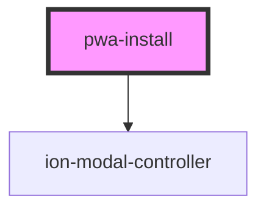

# my-component

<!-- Auto Generated Below -->

## Properties

| Property       | Attribute      | Description | Type      | Default     |
| -------------- | -------------- | ----------- | --------- | ----------- |
| `forceshow`    | `forceshow`    |             | `boolean` | `undefined` |
| `iconpath`     | `iconpath`     |             | `string`  | `undefined` |
| `manifestpath` | `manifestpath` |             | `string`  | `undefined` |

## Dependencies

### Depends on

- ion-modal-controller

### Graph

----------------------------------------------

*Built with [StencilJS](https://stenciljs.com/)*
